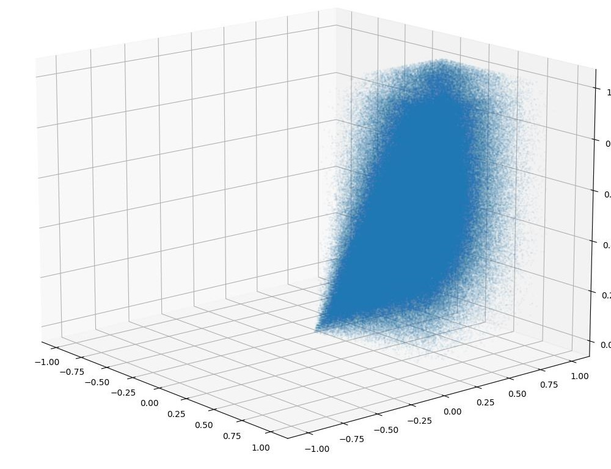

# 3D Orbitals – Cerium Atom

This project visualizes **3D electron probability distributions** of the **4f orbitals of the Cerium atom**.

---

## Generated Orbital Visualizations

---

## Description

The simulation:

- Computes radial and angular components of 4f orbitals  
- Generates probability density distributions  
- Samples electron coordinates  
- Produces 3D scatter plots of Cerium’s 4f orbitals  

Built using Python, NumPy, Pandas, and Matplotlib.
